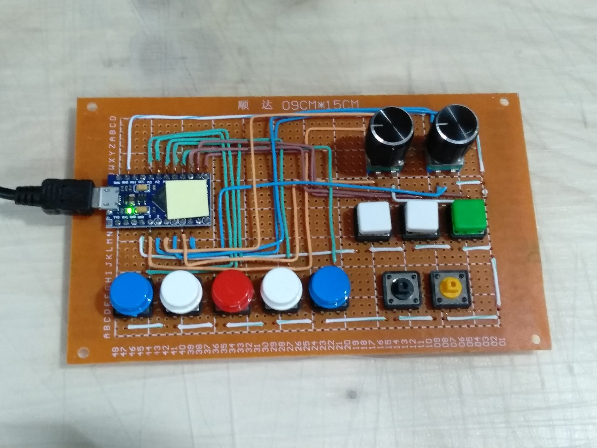

# arduino-keyboard

## My super messy arduino keyboard

I used this to adjust my 3 monitor display brightness and contrast.

It used Arduino Pro Micro.

When key is press it send combination of keyboard input to computer then I config [ClickMonitorDDC](http://clickmonitorddc.bplaced.net) to take those combination then adjust my monitor brightness and contrast.
